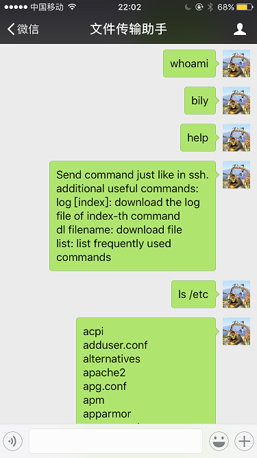

# wessh
Make your WeChat function like ssh.

## Introduction
Use this simple python script, you can:
 - send commands to server by WeChat just like what you will do in a ssh session.
 - download files to WeChat from server.
 - get log files of executed commands.

## Dependency
- itchat

## Usage
1. clone this repository to your server
```bash
git clone https://github.com/bilylee/wessh.git
```

2. run this script in your server
```bash
cd wessh
tmux # put commands that last for a long time in tmux :)
python wessh.py
```

3. scan the QR code to login your wechat account.

4. now you can send bash commands in your filehelper just like in a ssh.



**CAUTION**: you can only send commands by your phone since WeChat doesn't allow multiple logins in different devices. Use other devices(like computer or web browsers), this script will exit. 

## Advanced usage
- you can get help message by using the `help` command.
- commands that doesn't belong to the `SIMPLE_OUTPUT_CMD` list will save their stdout and stderr to a log file. You can get this log file by use `log` command if this is the lastest command, or `log index_number` where index_number is the interger number right below your sent command.
- use `dl filepath` to download files from your server. 


